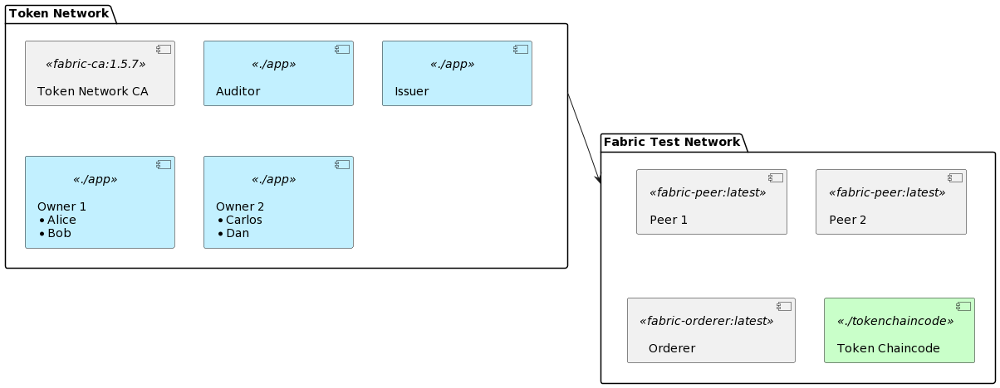
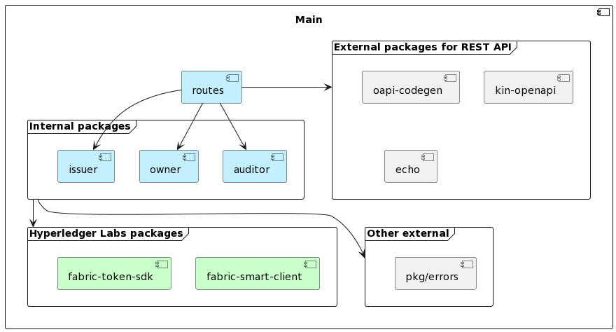

# Token SDK Sample API

This is a service with a REST API that wraps the [Token SDK](https://github.com/hyperledger-labs/fabric-token-sdk) to issue, transfer and redeem tokens backed by a Hyperledger Fabric network for validation and settlement.

Several instances of this service form a Layer 2 network that can transact amongst each other, with an (optional but currently configured to be required) auditor role who has to approve every transaction. The ledger data does not reveal balances, transaction amounts and identities of transaction parties. UTXO Tokens are owned by pseudonymous keys and other details are obscured with Zero Knowledge Proofs.

This sample is intended to get familiar with the features of the Token SDK and as a starting point for a proof of concept. The repo contains a basic development setup with:

-   An issuer node
-   An auditor node
-   Two owner nodes, with wallets for Alice, Bob, Carlos and Dan
-   A Certificate Authority
-   Configuration to use a Fabric test network.



[plantuml](https://www.plantuml.com/plantuml/uml/bPB1IiD048RlUOgXteHM4nIXbD8O4RnO3mKllKmtssR9PcRPtL14V7Up6vMqHQctOMU-d-NZNpYFrhUDJbojoA351Xf5XKRdNbNfAqXlhfF4eAXn9s6qubeIF4k_PrkF01ruhk4z0H3S62P97aPhEZY38e-N0c4sWorkh19ZWTDqSZkvW_dy6CxRKdcsaS6s3D3a2etfJk4YDqOhWLun7NDFphMonvHpPsFBFKaBwPek8UzkP1ZkUHDpEFrdJ1Re0grc5wO7f3ud-ptdOw3tCSg1bNJ-G7AbjwUINsJuTzoRRanXe3SyJ3Nw41GDdvBP3vcT3IvjAUsNO-xd0HjV_iBxMXGLAX9Sohu_GlHkV5YAxrtKj9AY8jQyUmkMGjF6utcGaImabLrhFm40)

The source code contains features for all roles (issuer, auditor and owner). The available functionality depends on the configured accounts (e.g. only the account that is configured as Issuer in the token chaincode parameters can issue tokens).

## Features

Main flows:

- [X] issue token
- [X] transfer
- [X] redeem / burn
- [X] owner get balances
- [X] owner transaction history
- [ ] auditor get balances
- [X] auditor transaction history
- [ ] issuer transaction history
- [ ] swap

Additional features:

- [X] Documented REST API
- [X] Basic end to end tests
- [X] Support for multiple token types
- [X] Multiple accounts per node
- [X] Use Idemix (privacy preserving) accounts created by a Fabric CA
- [X] Pre-configured and easy to start for development

### Out of scope for now

-   HTLC locks (hashed timelock contracts)
-   Register/enroll new token accounts on a running network
-   Business flows for redemption or issuance
-   Advanced transaction history (queries, rolling balance, pagination, etc)
-   Denylist / revocation and other business logic for auditor
-   Idemix users to submit the transactions to Fabric anonymously
-   Production configuration (e.g. deployment, networking, security, resilience, key management)

### Known issues

-   This repo cannot build on go 1.21 yet due to a transitive depencency (Fabric Smart Client -> go-libp2p -> quic-go) [GitHub Issue](https://github.com/hyperledger-labs/fabric-smart-client/issues/491)
-   There are no end to end tests for the second owner node yet.
-   The auditor cannot see transactions to users on the second owner node.
-   Health and readiness checks don't check health or readiness (except API being available)

## Getting started

Prerequisites:

- bash
- golang 1.20
- git
- docker
- docker-compose

### Install dependencies

Install the Fabric Samples, docker images, and binaries. The code only works with Fabric CA 1.5.7+, so even if you cloned the fabric-samples repo before, you may have to re-run it somewhere else to get the latest versions.

```bash 
curl -sSLO https://raw.githubusercontent.com/hyperledger/fabric/main/scripts/install-fabric.sh && chmod +x install-fabric.sh
./install-fabric.sh --ca-version 1.5.7
```

Make sure that the new binaries are in your path. Change the following lines and add them to your `~/.bashrc` or `~/.zshrc` file (and restart your terminal):

```bash
export PATH=/your/path/to/fabric-samples/bin:$PATH
export TEST_NETWORK_HOME=/your/path/to/fabric-samples/test-network
```

Validate that the CA is at 1.5.7 by executing `fabric-ca-client version`.

Install tokengen.

```bash
go install github.com/hyperledger-labs/fabric-token-sdk/cmd/tokengen@010bf3c6d930
```

Now go to the root folder of your token-sdk sample, for instance in the fabric-samples dir:

```bash
cd fabric-samples/token-sdk
```

> You can have the token-sdk folder anywhere. The commands keep working, as long as you have the TEST_NETWORK_HOME variable set.
> See the bottom of this readme for instructions to use another Fabric network.

### Automatic start

The quickest way to get going is to run:

```bash
./scripts/up.sh
```

This generates the crypto material, starts Fabric, deploys the chaincode, and starts the token nodes.

When you're done and want to delete everything:

```bash
./scripts/down.sh
```

Alternatively, you can execute the steps manually.

### Manual start

#### Generate crypto material

In this step, we create all the identities which are used by the Token network. We use a normal Fabric CA for this. Technically, only the Owner identities (the wallets that will hold the tokens) need some form of hierarchy; they use Idemix credentials which must be issued by a single, known issuer (see [Fabric documentation](https://hyperledger-fabric.readthedocs.io/en/latest/idemix.html) for more info about idemix). To keep things simple, we use the same CA for the other identities too. The Token SDK expects the folders for the identities to be in Fabric's 'msp' structure.

The following crypto will be generated:

 - Fabric Smart Client node identities, used by the nodes to authenticate each other
 - Token Issuer identity (x509 certificate and private key)
 - Token Auditor identity (x509 certificate and private key)
 - Owner identities (idemix credentials)

```bash
docker-compose -f compose-ca.yaml up -d
./scripts/enroll-users.sh
```

> If you want, you can stop the CA now. You don't need it unless you want to register more users. 
> 
> ```bash
> docker-compose -f compose-ca.yaml down
> ```

The Issuer and Auditor identities are used by the Token Chaincode to validate token transactions. It also needs the identity of the CA that issues the Idemix credentials to the Owner wallets. The tokengen command generates the configuration that contains these identities and the cryptographic parameters for the proofs. We store it in the `tokenchaincode` folder, so that it will be baked into the chaincode docker image later.

```bash
tokengen gen dlog --base 300 --exponent 5 --issuers keys/issuer/iss/msp --idemix keys/owner1/wallet/alice --auditors keys/auditor/aud/msp --output tokenchaincode
```

> You only have to do this once. But if for any reason you want to re-generate the material: `rm -rf keys; rm tokenchaincode/zkatdlog_pp.json` and execute the steps above again.

#### Start Fabric and install the chaincode

For simplicity, in this sample all nodes use the credentials of User1 from Org1MSP and have Peer1 as a trusted peer. In a more serious setup, each node would have its own (idemix) Fabric user and _may_ have it's own MSP and peers, depending on the network topology and trust relationships.

Start a Fabric sample network and deploy the Token Chaincode as a service:

```bash
bash "$TEST_NETWORK_HOME/network.sh" up createChannel
INIT_REQUIRED="--init-required" "$TEST_NETWORK_HOME/network.sh deployCCAAS"  -ccn tokenchaincode -ccp $(pwd)/tokenchaincode -cci "init" -verbose -ccs 1

mkdir -p keys/fabric
cp -r "$TEST_NETWORK_HOME/organizations" keys/fabric/
```

> It is possible that the init transaction fails like this: Error: endorsement failure during invoke. response: status:500 message:"error in simulation: failed to execute transaction x: could not launch chaincode tokenchaincode_1.0:x: chaincode registration failed: connection to tokenchaincode_1.0:x failed: error cannot create connection for tokenchaincode_1.0:x: error creating grpc connection to peer0org2_tokenchaincode_ccaas:9999: failed to create new connection: context deadline exceeded" 
Invoke execution on peer0.org1 peer0.org2 failed 
Deploying chaincode-as-a-service failed
> 
>  To be sure that it has time to start, edit the following file: `$TEST_NETWORK_HOME/scripts/deployCCAAS.sh`. Change the line towards the bottom that says `chaincodeInvokeInit 1 2` to `sleep 5 && chaincodeInvokeInit 1 2`. Then, increment the ccs number in the command above and run it again to upgrade the chaincode version.

> To fully remove the whole network:
> ```bash
> docker stop peer0org1_tokenchaincode_ccaas peer0org2_tokenchaincode_ccaas
>  bash "$TEST_NETWORK_HOME/network.sh" down
>  rm -rf keys/fabric
>  ```

#### Start the Token network

```bash
docker-compose up -d
```

The services are running on the following ports:

- 8080 API documentation
- 9000 auditor
- 9100 issuer
- 9200 owner (alice and bob)
- 9300 owner 2 (carlos and dan)

Now let's issue and transfer some tokens! View the API documentation and try some actions at [http://localhost:8080](http://localhost:8080). Or, directly from the commandline:

```bash
curl -X POST http://localhost:9100/api/v1/issuer/issue -H 'Content-Type: application/json' -d '{
    "amount": {"code": "EURX","value": 1000},
    "counterparty": {"node": "owner1","account": "alice"},
    "message": "hello world!"    
}'

curl -X GET http://localhost:9200/api/v1/owner/accounts

curl -X POST http://localhost:9200/api/v1/owner/accounts/alice/transfer -H 'Content-Type: application/json' -d '{
    "amount": {"code": "EURX","value": 100},
    "counterparty": {"node": "owner1","account": "bob"},
    "message": "hello bob!"    
}'

curl -X GET http://localhost:9200/api/v1/owner/accounts/bob/transactions
```

## Development

### End to end tests

See the `e2e` folder for some tests that exercise the APIs. The end to end tests require the services to be running. They create new transactions, so don't run them on a deployment you want to keep clean.

```bash
go test ./e2e -count=1 -v
```

### Code structure

Each role (issuer, auditor, owner) has their own golang package. Only `main` depends on all the roles. The roles don't know about each other and they don't know `routes`.

This means that it's fairly easy to remove a role, or to entirely replace the REST API layer, without impacting other code.



[plantuml](http://www.plantuml.com/plantuml/uml/RP71RhCm48JlVeeLEQF_3QBa4EcFrAfLcrkLmyOin09shRLH4rLvzne8Qg0z8COxmyVOteI86hksCLPQBqmS8Nj6nnby6O0FbIvIE08662Mijjutpc9qmYbHAhO4sPuZAMC37csD5OMi_yJvWP8us1KkYWwWf9UKb70XT3G6almZ89zyzvDQ-ZTZO6gO5_cwPpnCrlrFP-l4C3_r_ryzQKD5HGfFU0hpRP2FqpvAFAcpUMXHOsuRHno7IcMmi3gGFRCqKbrduIWrSHwAUaYczo9vIu_pOstoyQ7MIpoJ0bt6ixrtaQcBhwj_f2eQZhyeOXumkylYSg0KXRVT-m6sh_ix5YUie7UvbO8gug5nFnYjsd4kdZWD1YUjHuFiMOP9B_eoixDES7Cp6-AYQvjl)

Packages are organized by feature. Each feature contains the 'service' part with some business logic, and a 'view' part if the action requires a session with another node. For more information about Views and the Token SDK, check out an example on the [Token SDK GitHub](https://github.com/hyperledger-labs/fabric-token-sdk/blob/main/samples/fungible/README.md).

```
src
├── main.go
├── auditor
│   ├── audit.go
│   ├── balance.go
│   └── history.go
├── issuer
│   └── issue.go
├── owner
│   ├── accept.go
│   ├── balance.go
│   ├── history.go
│   ├── redeem.go
│   └── transfer.go
└── routes
    ├── auditor.go
    ├── issuer.go
    ├── operations.go
    ├── owner.go
    ├── routes.gen.go
    └── server.go
```

### Add or change a REST API endpoint

We generate the API based on `swagger.yaml`. Any changes should be made in this file first! Then generate the code with:

```bash
go install github.com/deepmap/oapi-codegen/cmd/oapi-codegen@latest

oapi-codegen -config oapi-server.yaml swagger.yaml
oapi-codegen -config oapi-e2e.yaml swagger.yaml
```

### Upgrade the Token SDK and Fabric Smart Client versions

Token SDK and Fabric Smart Client are under active development. To upgrade to the latest versions:

-   change the commit hash of fabric-smart-client and fabric-token-sdk in src/go.mod
-   change the commit hash in tokenchaincode/Dockerfile
-   install tokengen with the new commit hash, and update the readme and up.sh

### Use another Fabric network

Of course you're not tied to the Fabric samples testnetwork. If you want to anchor your Token services to another blockchain, you have to:

1. Deploy the token chaincode with the generated parameters to the Fabric network
2. Configure the token services with the correct channel, peer and orderer addresses and certs, MSP configuration, and a user (see the `core.yaml` files in the `conf` dir).

### Add a user / account

To add another user, simply register and enroll it at the Token CA (see `scripts/enroll-users.sh`), and configure it at one of the owner nodes (see `conf` dir).

### Run the service directly (instead of with docker-compose)

For a faster development cycle, you may choose to run the services outside of docker. It requires some adjustments to your environment to make the paths and routes work.

Add the following to your `/etc/hosts`:

```
127.0.0.1 peer0.org1.example.com
127.0.0.1 peer0.org2.example.com
127.0.0.1 orderer.example.com
127.0.0.1 owner1.example.com
127.0.0.1 owner2.example.com
127.0.0.1 auditor.example.com
127.0.0.1 issuer.example.com
```

> The Token SDK discovers the peer addresses from the channel config (after connecting to a configured trusted peer).

For the paths you have two options:

1. Find/replace all instances of /var/fsc in the conf directory with the path to this repo.
2.  Create a symlink to this folder to make the configuration files work (they don't play nice with relative paths):
    ```bash
    sudo ln -s "${PWD}" /var/fsc 
    ```
    The advantage of this approach is that the configuration is portable across developer laptops and works with docker-compose as well as without.

Start the blockchain and deploy the chaincode (see above).

Instead of doing docker-compose up, start the token instances with (each in their own terminal):

```bash
go build -o tokens ./app

PORT=9000 CONF_DIR=./conf/auditor ./tokens
PORT=9100 CONF_DIR=./conf/issuer ./tokens
PORT=9200 CONF_DIR=./conf/owner1 ./tokens
PORT=9300 CONF_DIR=./conf/owner2 ./tokens
```

Now you can use the REST APIs to control the nodes.

When you made changes in the code, stop a node with CTRL+C, `go build -o tokens ./app` and start it again.

If you want to reset the transaction history:

```bash
rm -rf data/auditor data/issuer data/owner1 data/owner2 && mkdir data/auditor data/issuer data/owner1 data/owner2
```
